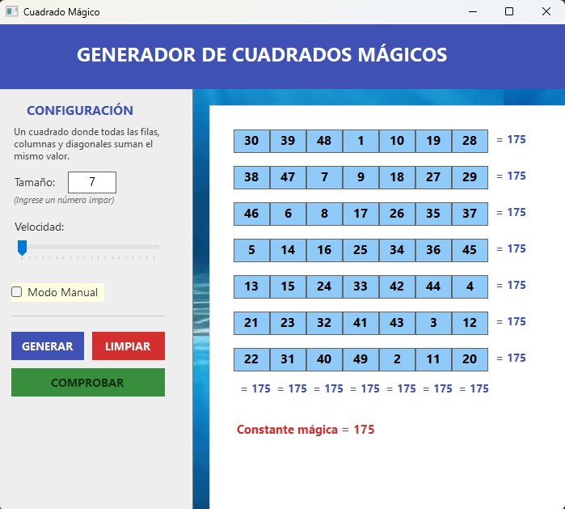

# Cuadrado Mágico en C# (Windows Forms)

## Descripción

Este proyecto es una aplicación de escritorio desarrollada en **C# con Windows Forms**, que permite generar y resolver cuadrados mágicos. Los usuarios pueden ir ingresando manualmente los valores a la matriz y verificar si cumple con las propiedades de un **Cuadrado Mágico**.


Un **Cuadrado Mágico** es una matriz de **n x n** en la que la suma de los elementos de cada fila, cada columna y ambas diagonales es la misma.

## Cómo llenar un cuadrado mágico
**Cuadrados mágicos de orden impar (3x3, 5x5, etc.)**
Para cuadrados mágicos de tamaño impar, usar el método de Siamese (también conocido como el método de De la Loubère). Aquí están los pasos:

  **1.** Empieza en la celda central de la primera fila :

      Coloca el número 1 en la celda central de la primera fila.
     
  **2.** Mueve diagonalmente hacia arriba y a la derecha :
  
      Para cada número consecutivo, muévete una celda hacia arriba y una hacia la derecha.
      
      Si sales del cuadrado por la parte superior, vuelve a entrar por la parte inferior.
      
      Si sales por la derecha, vuelve a entrar por la izquierda.
     
  **3.** Si la celda está ocupada, baja una fila :
  
      Si la celda a la que intentas moverte ya está ocupada, 
      baja una fila desde tu posición actual y coloca el siguiente número allí.


## Captura de Pantalla



## Instalación y Ejecución

1. **Clona el repositorio:**
   ```sh
   git clone https://github.com/tu_usuario/cuadrado-magico.git
   ```

2. **Visual Studio:**

   Abrir el proyecto clanado desde Visual Studio

## Licencia
Este proyecto está licenciado bajo la MIT License - consulta el archivo LICENSE para más detalles.

---

**Desarrollado por Edison Guaichico** - [Perfil de GitHub](https://github.com/EdisonGP)
